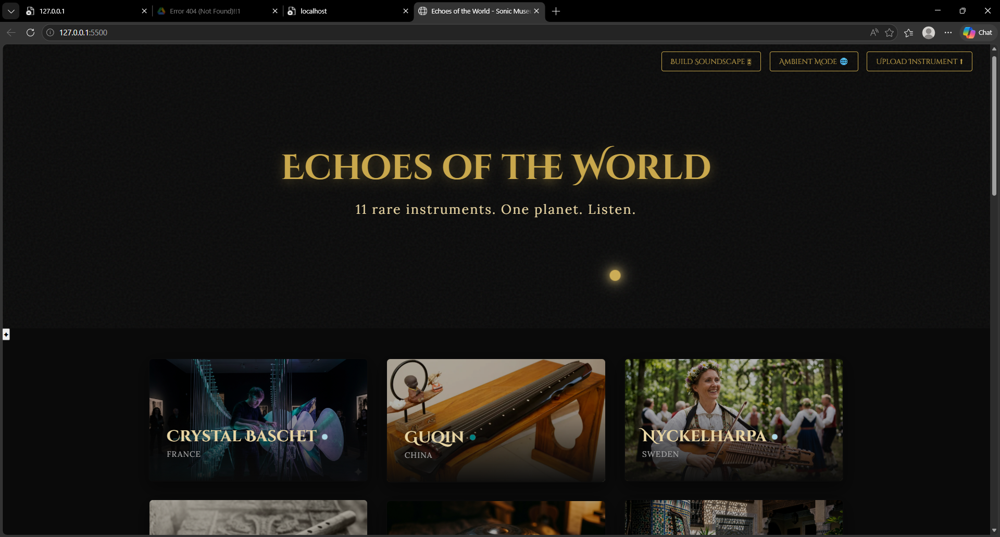
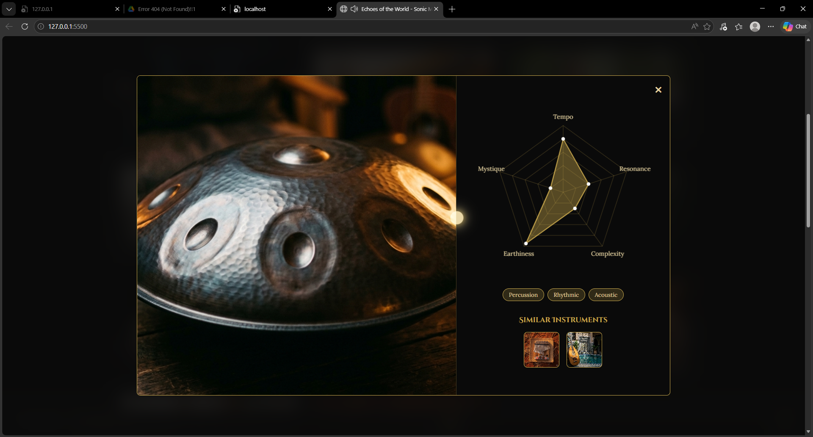
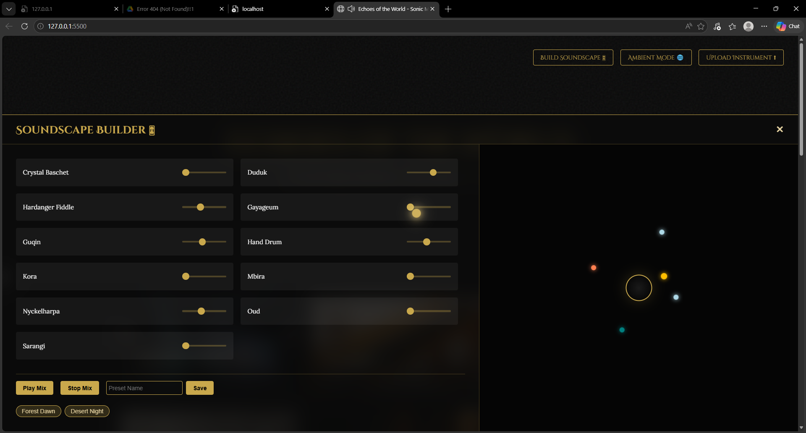

# 🌍 Echoes of the World — Sonic Museum

An immersive, single-page sonic museum showcasing **11 rare musical instruments** from across the globe.

## 📸 Screenshots

### Home Page


### Instrument DNA Visualizer


### Ambient Soundscape Builder



---

## 📁 Project Structure

```
root/
├── index.html              # Main website file
├── images/                 # Instrument images (JPG/PNG)
│   ├── crystal_baschet.png
│   ├── duduk.png
│   ├── fiddle.png
│   ├── gayageum.png
│   ├── guqin.png
│   ├── hand_drum.png
│   ├── kora.png
│   ├── mbira.png
│   ├── nyckelharpa.png
│   ├── oud.png
│   └── sarangi.png
└── audio/                  # Instrument audio files (MP3)
    ├── crystal_baschet.mp3
    ├── duduk.mp3
    ├── fiddle.mp3
    ├── gayageum.mp3
    ├── guqin.mp3
    ├── hand_drum.mp3
    ├── kora.mp3
    ├── mbira.mp3
    ├── nyckelharpa.mp3
    ├── oud.mp3
    └── sarangi.mp3
```

---

## ✨ Features

- **Instrument Gallery** — Dark masonry grid with full-bleed image cards; click any card to play its audio
- **Now Playing Bar** — Fixed bottom bar showing the current instrument with an animated waveform
- **Sonic Atlas** — Interactive SVG world map with pulsing pins at each instrument's country of origin; click a pin to play and highlight that instrument
- **Mood-Based Listening** — Side panel with 6 moods (Calm, Energised, Melancholic, Mystical, Adventurous, Meditative), each curating a subset of instruments in shuffle
- **Sound & Healing Corner** — Music therapy section with 3 use cases (Stress Relief, Focus, Sleep), crossfading between instruments at 45-second intervals
- **Instrument DNA Visualizer** — Full-screen overlay per instrument with a radar chart across 5 axes: Tempo, Resonance, Complexity, Earthiness, Mystique
- **Ambient Soundscape Builder** — Drawer with per-instrument volume sliders, orbital node visualizer, and saveable presets (e.g. *Forest Dawn*, *Desert Night*)
- **Custom Cursor** — Glowing golden trailing cursor
- **Page Load Animation** — Staggered card entrance with 100ms delays

---

## 🎼 Instruments Featured

| # | Instrument | Origin |
|---|-----------|--------|
| 1 | Crystal Baschet | France |
| 2 | Duduk | Armenia |
| 3 | Hardanger Fiddle | Norway |
| 4 | Nyckelharpa | Sweden |
| 5 | Kora | West Africa (Senegal) |
| 6 | Mbira | Zimbabwe |
| 7 | Oud | Middle East |
| 8 | Sarangi | India |
| 9 | Guqin | China |
| 10 | Gayageum | South Korea |
| 11 | Hand Drum (Hang) | Switzerland |

---

## 🛠 Tech Stack

- Plain **HTML5**, **CSS3**, **Vanilla JavaScript** — no frameworks or libraries
- Web Audio API for crossfading and ambient mixing
- Canvas API for radar chart visualization
- `localStorage` for saving soundscape presets

---

## 🚀 Running Locally

```bash
# Any static server works — pick one:
npx serve .
# or
python -m http.server 8000
```

Then open `http://localhost:8000` in your browser.

---

## 📋 Requirements

Any modern browser — Chrome, Firefox, Safari, or Edge.

---

## 📜 License

This project is for educational and demonstration purposes.
